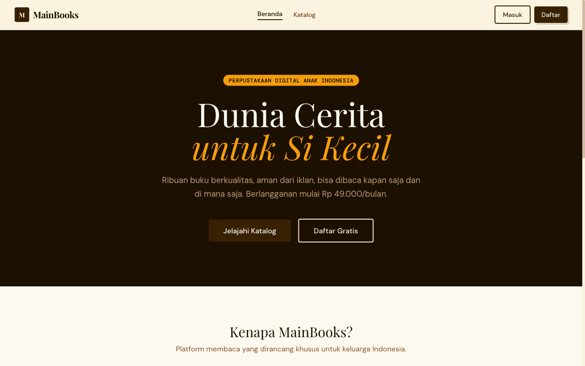
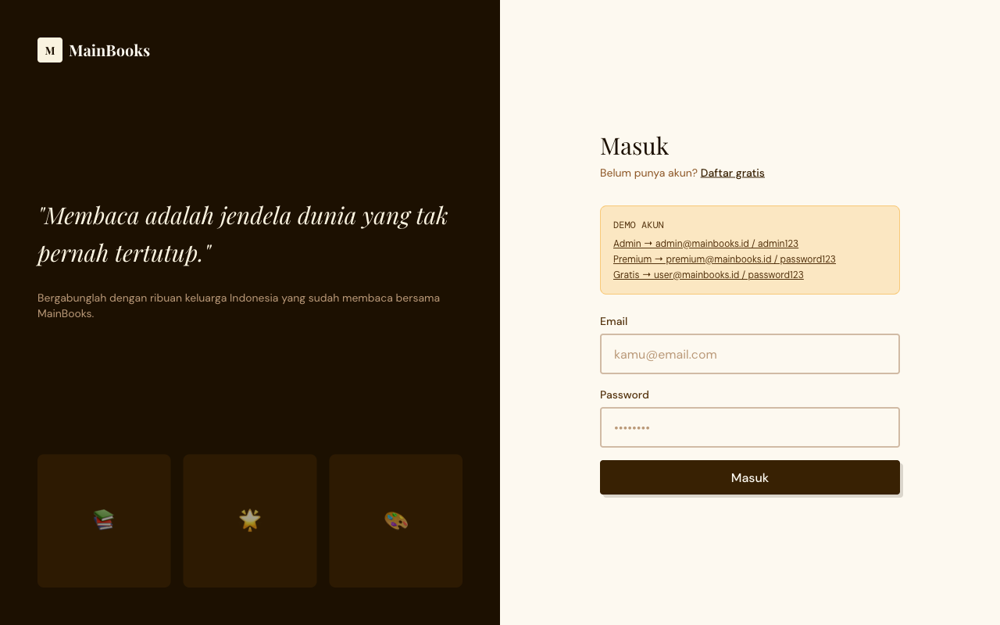
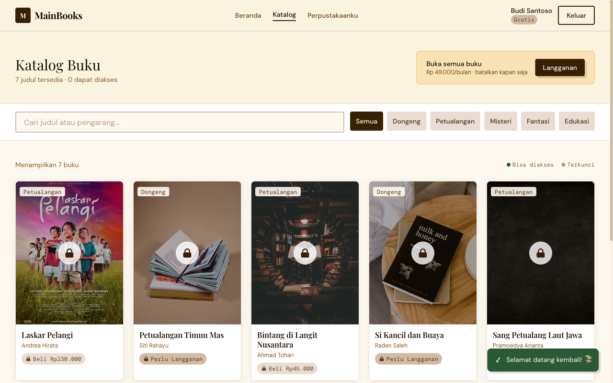
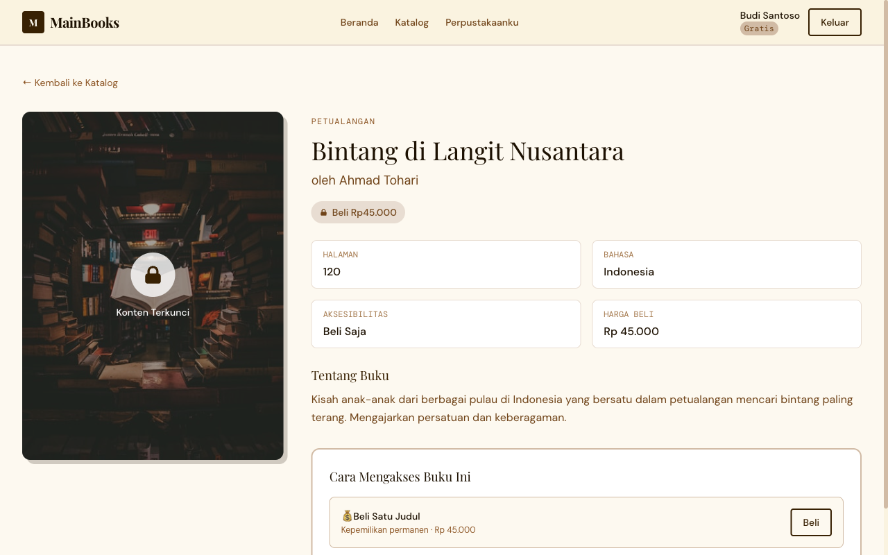
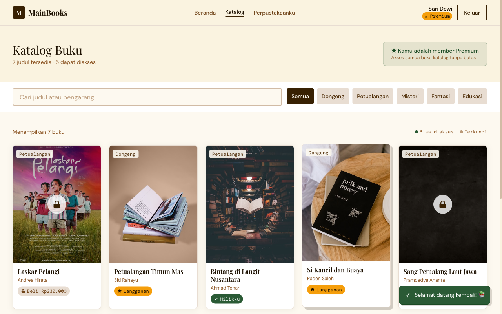
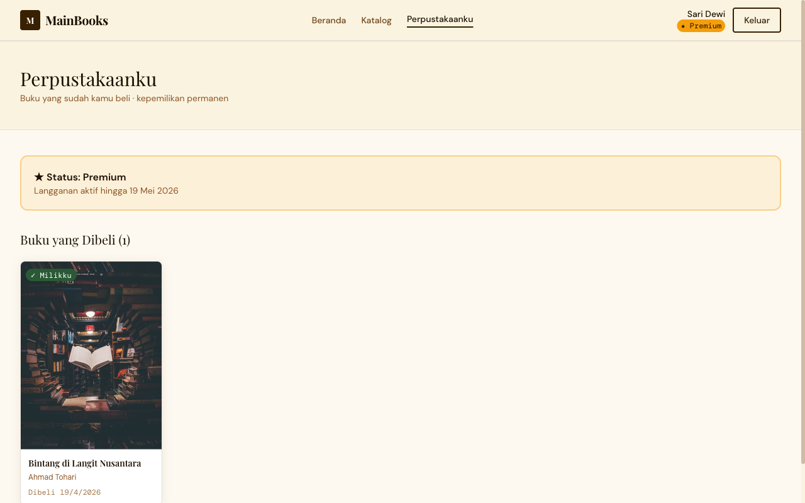
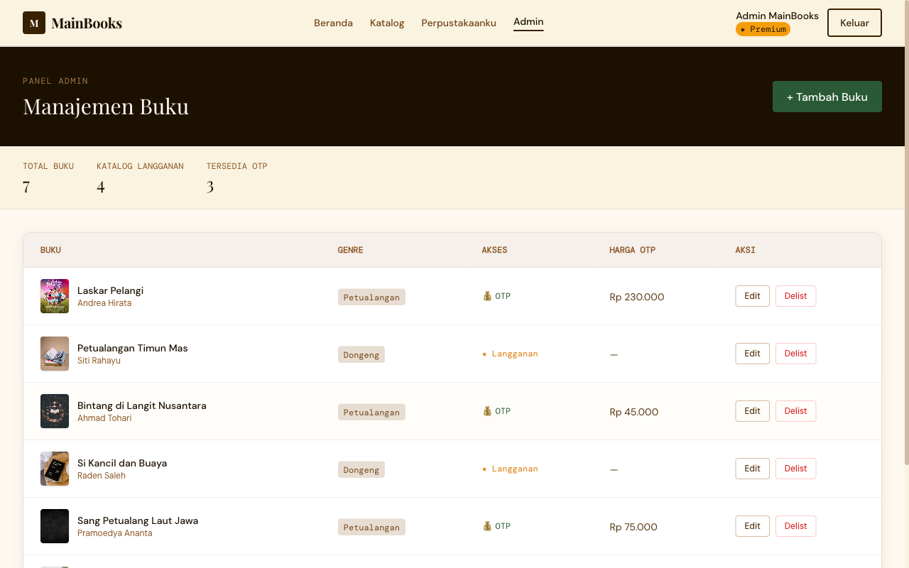
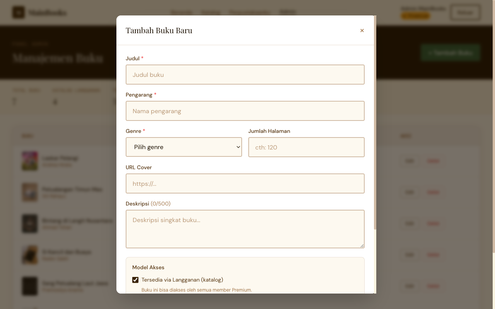

# MainBooks 📚
**Platform Buku Digital Anak Indonesia**

> Fullstack web application berbasis hybrid subscription + one-time-purchase (OTP) model untuk perpustakaan digital keluarga Indonesia.

---

## 🌐 Live Demo & Links

| Resource | URL |
|----------|-----|
| 🖥️ **Frontend (Vercel)** | [mainbooks-storeapp.vercel.app](https://mainbooks-storeapp.vercel.app) |
| ⚙️ **Backend API (Railway)** | [mainbooks-storeapp.up.railway.app](https://mainbooks-storeapp.up.railway.app) |
| 🏥 **API Health Check** | [/health](https://mainbooks-storeapp.up.railway.app/health) |
| 📄 **Product Specification Doc** | [Google Drive](https://drive.google.com/file/d/1bteBSPsH1jOTvS6dt83dlajCfWrtIhHi/view?usp=sharing) |
| 💻 **GitHub Repository** | [github.com/liandaraaa/mainbooks-claude-fullstack](https://github.com/liandaraaa/mainbooks-claude-fullstack) |

---

## 🎯 Demo Accounts

| Role | Email | Password |
|------|-------|----------|
| 👑 **Admin** | admin@mainbooks.id | admin123 |
| ⭐ **Premium** | premium@mainbooks.id | password123 |
| 🆓 **Free** | user@mainbooks.id | password123 |

> Quick-fill buttons tersedia langsung di halaman login.

---

## 📸 UI Screenshots

### Homepage

*Landing page dengan dark editorial theme, hero section, dan pricing overview.*

### Login Page

*Split-layout login dengan inspirational quote dan demo account quick-fill.*

### Katalog Buku — Free User (Semua Terkunci)

*Free user melihat 7 buku tersedia namun 0 dapat diakses. Lock overlay pada semua cover, badge "Perlu Langganan" atau "Beli RpX". Banner upgrade Premium tersedia.*

### Detail Buku — OTP Only (Terkunci)

*Detail "Bintang di Langit Nusantara" — aksesibilitas Beli Saja, harga Rp 45.000. CTA pembelian satuan tersedia.*

### Katalog Buku — Premium User (Terbuka)

*Premium user "Sari Dewi" dengan 5 dari 7 buku accessible. Badge amber "★ Langganan" dan hijau "✓ Milikku" terlihat jelas.*

### Perpustakaanku — My Library

*Status Premium aktif hingga 19 Mei 2026. Buku yang dibeli OTP tampil dengan badge "✓ Milikku" dan tanggal pembelian permanen.*

### Admin Panel — Manajemen Buku

*Dashboard admin dengan stats (Total: 7, Katalog: 4, OTP: 3). Tabel buku lengkap dengan aksi Edit dan Delist per buku.*

### Admin — Form Tambah Buku

*Modal form dengan validasi real-time: judul & pengarang (required), genre, cover URL, deskripsi counter 0/500, dan model akses (subscription/OTP).*

---

## 🛠️ Tech Stack

| Layer | Technology |
|-------|-----------|
| **Frontend** | React 18, React Router v6, Tailwind CSS, Axios |
| **Backend** | Node.js, Express.js, JWT, bcrypt |
| **Database** | PostgreSQL 14+ via Knex.js |
| **Infrastructure** | Railway (Backend + DB), Vercel (Frontend) |
| **Testing** | Jest + Supertest — 107 tests, 78.6% coverage |

---

## 🚀 Fitur

### User Features
- 🔐 **Autentikasi** — Register, login, JWT token management
- 📚 **Katalog Buku** — Browse, search, filter by genre
- 🔒 **Access Control** — Visual lock/unlock per buku berdasarkan status
- ⭐ **Subscribe Premium** — Akses semua buku katalog (Rp 49.000/bln)
- 💰 **Beli Satuan (OTP)** — Kepemilikan permanen per judul
- 📖 **My Library** — Koleksi buku yang sudah dibeli

### Admin Features
- ➕ **Create** buku baru dengan validasi form lengkap
- ✏️ **Edit** metadata buku (judul, pengarang, harga, model akses)
- 🗑️ **Delist** buku (soft delete — grandfathered access untuk buyer existing)
- 📊 **Dashboard stats** — total buku, katalog, OTP

---

## 📐 Access Control Logic

```
Akses Diberikan JIKA:
  (Status_Langganan == Aktif AND Buku_Termasuk_Katalog)
  ATAU
  (User_Memiliki_Entitlement_OTP == True)
```

**Edge Cases yang Dihandle:**
- Langganan kadaluarsa → buku katalog terkunci, OTP tetap terbuka
- Buku di-delist → soft delete, grandfathered access untuk existing buyers
- Subscribe ulang → cek sub_end_date valid sebelum proses
- Beli buku yang sudah dimiliki → return 400 "You already own this book"

---

## 🗄️ Database Schema

```
users        — id, email, password_hash, name, tier_status, sub_end_date, role
books        — id, title, author, description, cover_url, genre, pages,
               language, is_sub_eligible, otp_price, is_active, version
entitlements — id, user_id (FK), book_id (FK), access_type (SUB|PURCHASE), granted_at
```

---

## 📡 API Endpoints

```
POST   /api/auth/register              Public
POST   /api/auth/login                 Public
GET    /api/auth/me                    Auth required

GET    /api/books                      Optional auth (attach access info if logged in)
GET    /api/books/:id                  Optional auth
POST   /api/books                      Admin only
PUT    /api/books/:id                  Admin only
DELETE /api/books/:id                  Admin only (soft delete)

POST   /api/entitlements/subscribe     Auth required
POST   /api/entitlements/purchase      Auth required
GET    /api/entitlements/my            Auth required
```

---

## ⚙️ Setup & Menjalankan Lokal

### Prerequisites
- Node.js 18+
- PostgreSQL 14+

### 1. Clone Repository
```bash
git clone https://github.com/liandaraaa/mainbooks-claude-fullstack.git
cd mainbooks-claude-fullstack
```

### 2. Setup Database
```bash
createdb mainbooks_db
```

### 3. Backend
```bash
cd backend
cp .env.example .env        # sesuaikan DB credentials
npm install
npx knex migrate:latest
npx knex seed:run
npm start                   # → http://localhost:3001
```

### 4. Frontend
```bash
cd frontend
npm install
npm start                   # → http://localhost:3000
```

---

## 🧪 Testing

```bash
cd backend
npm test
```

**107 tests · 10 suites · 78.6% coverage**

| Suite | Tests | Coverage |
|-------|-------|---------|
| auth.test.js | 7 | authController 100% |
| books.test.js | 8 | bookController 98.8% |
| entitlements.test.js | 8 | entitlementController 88% |
| middleware.test.js | 8 | auth middleware 100% |
| integration.test.js | 29 | all routes 100% |
| books_extended.test.js | 11 | checkAccess branches |
| auth_extended.test.js | 9 | error paths, expired sub |
| entitlements_extended.test.js | 9 | edge cases |
| coverage_boost.test.js | 18 | DB error paths |
| coverage_routes.test.js | 8 | optionalAuth branches |

---

## 🗺️ Struktur Proyek

```
mainbooks/
├── backend/
│   ├── src/
│   │   ├── app.js
│   │   ├── controllers/       # auth, books, entitlements
│   │   ├── db/
│   │   │   ├── migrations/    # schema PostgreSQL
│   │   │   └── seeds/         # demo data
│   │   ├── middleware/        # JWT auth, admin guard
│   │   └── routes/
│   ├── tests/                 # 107 unit & integration tests
│   └── knexfile.js
│
└── frontend/
    └── src/
        ├── api/               # axios client
        ├── components/
        │   ├── common/        # Navbar, AccessBadge, Toast, ProtectedRoute
        │   └── books/         # BookCard
        ├── context/           # AuthContext
        └── pages/             # HomePage, BooksPage, BookDetailPage,
                               # MyLibraryPage, AdminPage, LoginPage, RegisterPage
```

---

## 📋 Roadmap

| Fase | Status | Fokus |
|------|--------|-------|
| Fase 1 — Foundation | ✅ Done | Core app, auth, CRUD, deploy |
| Fase 2 — Monetization | 🔜 Next | Payment gateway, auto-renew |
| Fase 3 — Retention | 📅 Planned | AI recommendations, streaks |
| Fase 4 — Scale | 📅 Planned | Mobile app, offline mode |

---

## 📄 Dokumentasi

Product Specification Document (PDF) tersedia di Google Drive:

📎 [MainBooks_Product_Specification_v1.3.pdf](https://drive.google.com/file/d/1bteBSPsH1jOTvS6dt83dlajCfWrtIhHi/view?usp=sharing)

Dokumen mencakup: Key Product Decisions, Roadmap, Success Metrics, Access Control Design, System Design, Test Cases, dan proses penggunaan AI tools.

---

## 🤖 Built with AI

Project ini dibangun dengan bantuan **Claude (Anthropic)** sebagai AI pair programmer. Claude membantu dalam scaffolding awal, bug fixing, penulisan unit tests, dan troubleshooting deployment — menghemat estimasi 60-70% waktu development untuk boilerplate dan repetitive tasks.

---

*© 2026 MainBooks · Platform Buku Digital Anak Indonesia*
